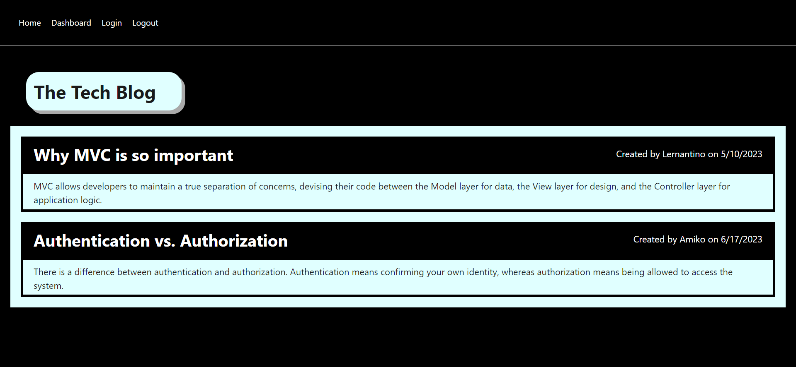

# **Tech Blog**

  [](https://opensource.org/licenses/MIT)

  ## **Description**
  This app is a blog site about technical concepts, recent advancements, and new technologies. Developers can publish their articles, blog posts and comment on other developers’ posts, as well. 

  ## **Table of Contents:**
  * [Technology Used](#technology-used)
  * [Installation](#installation)
  * [Usage](#usage)
  * [Tech Blog deployed application](#tech-blog-deployed-application) 
  * [Test Cases](#test-cases)
  * [Credits](#credits)
  * [Contribute](#contribute)
  * [License](#license)
  * [Repository](#repository)
  * [Questions](#questions)

  ## **Technology Used**
  This app follows the MVC paradigm in its architectural structure, using Handlebars.js as the templating language, Sequelize as the ORM which connects to a MySQL database for the Models, and uses Express.js API for the Controllers.
  It also uses the [dotenv package](https://www.npmjs.com/package/dotenv) to use environment variables, the [bcrypt package](https://www.npmjs.com/package/bcrypt) to hash passwords, and the [express-session](https://www.npmjs.com/package/express-session) and [connect-session-sequelize](https://www.npmjs.com/package/connect-session-sequelize) packages to add authentication. This app is deployed in Heroku.

  ## **Installation**
  To download the source code for this app, clone the [Tech Blog GitHub repo](https://github.com/DonnaThompson7/Tech-Blog), then to start the app, on the command line, run npm install. This will create the node_modules directory in your current directory (if one doesnt exist yet) and will download the package to that directory. You can check to see if you already have node.js installed by running either the npm -v or the npm version command. Note:If there is no package.jsonfile in the local directory, the latest version of the package is installed. Connect to mysql and create the database, exit the mysql shell, then run npm seed, and run npm start.

  ## **Usage**
```md
User Story:
AS A developer who writes about tech
I WANT a CMS-style blog site
SO THAT I can publish articles, blog posts, and my thoughts and opinions
```
  * When I visit the site for the first time, then I am presented with the homepage, which includes existing blog posts if any have been posted; navigation links for the homepage and the dashboard; and the option to log in. 
  * When I click on the homepage option, then I am taken to the homepage. When I click on any other links in the navigation, then I am prompted to either sign up or sign in. 
  * When I choose to sign up, then I am prompted to create a username and password. When I click on the sign-up button, then my user credentials are saved and I am logged into the site. When I revisit the site at a later time and choose to sign in, then I am prompted to enter my username and password. When I am signed in to the site, then I see navigation links for the homepage, the dashboard, and the option to log out. 
  * When I click on the homepage option in the navigation, then I am taken to the homepage and presented with existing blog posts that include the post title and the date created. 
  * When I click on an existing blog post, then I am presented with the post title, contents, post creator’s username, and date created for that post and have the option to leave a comment. When I enter a comment and click on the submit button while signed in, then the comment is saved and the post is updated to display the comment, the comment creator’s username, and the date created. 
  * When I click on the dashboard option in the navigation, then I am taken to the dashboard and presented with any blog posts I have already created and the option to add a new blog post. 
  * When I click on the button to add a new blog post, then I am prompted to enter both a title and contents for my blog post. When I click on the button to create a new blog post, then the title and contents of my post are saved and I am taken back to an updated dashboard with my new blog post. 
  * When I click on one of my existing posts in the dashboard, then I am able to delete or update my post and taken back to an updated dashboard. 
  * When I click on the logout option in the navigation, then I am signed out of the site. When I am idle on the site for more than a set time, then I am able to view posts and comments but I am prompted to log in again before I can add, update, or delete posts


  ## **Tech Blog deployed application**
  [](https://donna-tech-blog-986d6280cfda.herokuapp.com/)

  ## **Test Cases**
  1.Start the app and view the homepage.  2.Login or Signup. 3.View Dashboard. 4.Navigate to the Home page, select a blog post and view details. 5.Add a comment on an existing blog post. 6.Navigate to Dashboard and add a blog post. 7.From Dashboard, select a blog post and edit it. 8.Delete a blog post. 9.Logout. 

  ## **Credits**
  Donna Thompson, developer

  ## **Contribute**
  If you would like to contribute to this app, please follow the guidelines of The Contributor Covenant (found here https://www.contributor-covenant.org/version/2/1/code_of_conduct/ ). Submit contributions to the email below.

  ## **License**
Licensed under [The MIT License](https://opensource.org/licenses/MIT).

  ## **Repository** 
  <a name="repository">https://github.com/DonnaThompson7/Tech-Blog</a>

  ## **Questions**
  Please visit my GitHub profile at https://github.com/https://github.com/DonnaThompson7 <br /> Contact me at dlthompson7@icloud.com to report issues, contribute, or if you have additional questions.
